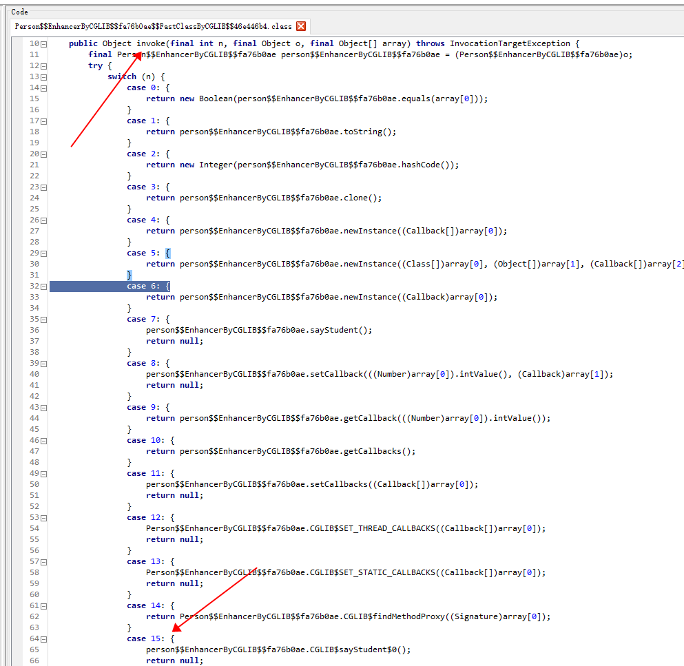

关于java的动态代理，首先我们需要了解与之相匹配的设计模式---代理模式。而对于创建代理类的时间点，又可以分为静态代理和动态代理。

### 代理模式

代理模式是常用的java设计模式，<font color = red>它的特征是代理类与委托类有同样的接口</font>，代理类负责为委托类预处理消息、过滤消息、把消息转发给委托类，以及事后处理消息等。代理类并不真正实现服务，而是具有委托类的实例对象，通过委托类对应的实例对象调用委托类的相关方法，来提供特定的服务。通俗的说，代理类就相当于一个中间商，负责对两边的对象的操作进行响应。


### 静态代理

-  静态代理是在程序员编程时由程序员创建，也就是在编译时就已经把代理类、接口等确定下来，在程序运行，代理类的.class文件已经生成。

下面举个简单的例子，Person实现输出一句话，而我们通过代理类的方法来调用对应Person类的方法，达到输出结果。

为什么不直接访问Person类的方法，还需要多次一举的建一个代理类呢？因为这种间接性可以带来其他用途，我们可以在调用对应方法之前或之后处理一些需要操作，与之联系的就是AOP编程，我们能在一个切点之前或之后执行一些操作，切点就是方法。

Person 接口：
```java 
public interface Person {
    void sayPerson();
}
```
PersonImpl  实现类：
```java
public class PersonImpl implements Person{
    @Override
    public void sayPerson() {
        System.out.println("这是Person类的实现。。。");
    }
}
```
Person静态代理类：
```java
public class StaticProxy implements Person{

    Person person;

    public StaticProxy(Person person) {
        this.person = person;
    }

    @Override
    public void sayPerson() {
        System.out.println("代理类...");
        person.sayPerson();
    }
}
```
Main方法：
```java
public class ProxyMain {
    public static void main(String[] args) {
        Person person = new PersonImpl();

        //将person类传到静态代理类中
        StaticProxy staticProxy = new StaticProxy(person);

        //通过访问静态代理类的sayPerson方法调用person类的方法
        staticProxy.sayPerson();
    }
}
```
运行结果：


### JDK Proxy动态代理
- 动态代理是在运行时进行创建，和静态代理不同，<font color=red>动态代理创建的代理类存在于java虚拟机中，即在内存中</font>。上面的静态代理例子中，代理类是自己定义的，在程序运行之前已经编译完成，我们可以到具体的编译输出目录查找到.class文件。然而动态代理，代理类不是在代码中定义好的，而是在运行时动态生成的。
- 相比于静态代理，动态代理的优势在于很方便的对代理类的函数进行统一的处理，而不用修改每个代理类中的方法。
- 动态代理我们需要使用到java.lang.reflect.Proxy类 和 InvocationHandler接口，通过这个类和接口可以生成JDK动态代理类和代理对象。

下面举个简单例子：
Person 接口：
```java
public interface Person {
    void sayPerson();
}
```
Student类，实现Person接口：
```java
public class Student implements Person{
    @Override
    public void sayPerson() {
        System.out.println("我是学生，实现了Person类。。。");
    }
}
```
自定义一个类实现InvocationHandler接口，重写invoke方法，invoke方法中定义我们具体需要的操作和代理方法的调用。
```java
public class MyInvocationHandler<T> implements InvocationHandler {
    T target;

    public MyInvocationHandler(T target) {
        this.target = target;
    }

    /**
    *
    * @param proxy 代表动态代理对象
    * @param method 代表执行的方法
    * @param args   代表执行方法的参数
    * @return java.lang.Object
    * @exception
    **/
    @Override
    public Object invoke(Object proxy, Method method, Object[] args) throws Throwable {
        System.out.println("代理执行"+method.getName()+"方法");
        Object result = method.invoke(target, args);
        return result;
    }
}
```
Main方法：定义代理对象，并将该对象传入自定义的invocationHandler构造器，创建一个与代理对象相关联的invocationHandler，接下来使用Proxy类，创建一个代理对象。
```java
public class DynamicMain {
    public static void main(String[] args) {
        //创建一个学生实例
        Person student = new Student();

        //创建一个与代理对象相关联的invocationHandler
        MyInvocationHandler<Person> myInvocationHandler = new MyInvocationHandler<>(student);

        //Proxy创建一个代理对象来代理student，代理对象的每个执行方法都会替换执行invocationHandler中的invoke方法
        Person o = (Person) Proxy.newProxyInstance(Person.class.getClassLoader(), new Class[]{Person.class}, myInvocationHandler);

        o.sayPerson();
    }
}
```
运行结果：


### JDK Proxy动态代理原理分析

上述写了一个简单的动态代理例子，下面进行原理分析，首先从main方法的创建代理对象开始入手。代码中是利用Proxy.newProxyInstance来进行创建代理对象，我们查看该方法的源码。
```java
@CallerSensitive
    public static Object newProxyInstance(ClassLoader loader,
                                          Class<?>[] interfaces,
                                          InvocationHandler h)
        throws IllegalArgumentException
    {
        Objects.requireNonNull(h);

       final Class<?>[] intfs = interfaces.clone();
        final SecurityManager sm = System.getSecurityManager();
        if (sm != null) {
            checkProxyAccess(Reflection.getCallerClass(), loader, intfs);
        }

        /*
         * Look up or generate the designated proxy class.
         */
        Class<?> cl = getProxyClass0(loader, intfs);

        /*
         * Invoke its constructor with the designated invocation handler.
         */
        try {
            if (sm != null) {
                checkNewProxyPermission(Reflection.getCallerClass(), cl);
            }

            final Constructor<?> cons = cl.getConstructor(constructorParams);
            final InvocationHandler ih = h;
            if (!Modifier.isPublic(cl.getModifiers())) {
                AccessController.doPrivileged(new PrivilegedAction<Void>() {
                    public Void run() {
                        cons.setAccessible(true);
                        return null;
                    }
                });
            }
            return cons.newInstance(new Object[]{h});
        } catch (IllegalAccessException|InstantiationException e) {
            throw new InternalError(e.toString(), e);
        } catch (InvocationTargetException e) {
            Throwable t = e.getCause();
            if (t instanceof RuntimeException) {
                throw (RuntimeException) t;
            } else {
                throw new InternalError(t.toString(), t);
            }
        } catch (NoSuchMethodException e) {
            throw new InternalError(e.toString(), e);
        }
    }
```
其中，重要的关键步骤有如下几步，通过main方法中对应newProxyInstance方法的传入参数（代理类的类加载器、代理对象需要实现的接口、InvocationHandler），在运行时动态生成代理对象。
```java
//接口类的克隆
final Class<?>[] intfs = interfaces.clone();

/*
* 创建和查找代理类
* Look up or generate the designated proxy class.
*/
Class<?> cl = getProxyClass0(loader, intfs);

//获得代理类的构造器
final Constructor<?> cons = cl.getConstructor(constructorParams);

//通过代理类的构造器创建实例对象
return cons.newInstance(new Object[]{h});
```

因为是运行时动态生成的，.class文件缓存在java虚拟机中，这个文件中的内容就很重要，负责代理我们定义好的内容。具体查看的方法，可以通过`ProxyGenerator.generateProxyClass`打印到文件中查看。另外，我再下面cglib分析中介绍另外一种方法，具体的分析过程也类似。

<font color=red>注意：newProxyInstance中的Class<?>[] interfaces参数必须是接口，如果写成类，将出现如下错误，并且我们从这个参数名上就可以看出，它需要传入的是接口数组</font>
```java 
Exception in thread "main" java.lang.IllegalArgumentException: com.hcx.dynamic.Student is not an interface
	at java.lang.reflect.Proxy$ProxyClassFactory.apply(Proxy.java:590)
	at java.lang.reflect.Proxy$ProxyClassFactory.apply(Proxy.java:557) 
```

### cglib 动态代理

正是因为jdk 的Proxy方式代理的参数中必须是实现对应接口，这样没有实现接口的类就无法使用JDK Proxy实现代理，所以另外一种代理出现了，cglib。

cglib（Code Generation Library）是一个基于ASM的字节码生成库。它允许我们在运行时对字节码进行修改和动态生成。cglib是通过继承来实现代理，具体后面会通过生成的代理类class文件分析。

下面也是通过一个例子来开始：
直接定义一个Person类，<font color=red>不定义接口</font>
```java
public class Person {

    public void sayStudent(){
        System.out.println("这是Person类中的学生...");
    }

    public void sayTeacher(){
        System.out.println("这是Person类中的老师...");
    }
}
```
自定义MethodInceptor方法，实现MethodInterceptor接口，重写其中的intercept方法，方法中是具体代理的操作。intercept方法的四个参数：
- o 表示增强型的对象，即表示cglib代理的子类对象。不懂没关系，继续看后面的，看完回头想一下就明白了。（后续会说到增强型和不增强的区别和用途）
- method 表示要拦截的方法；
- objects 表示被拦截方法的参数；
- methodProxy 表示要触发父类的方法对象。
methodProxy.invokeSuper(o,objects)调用对应的目标方法。
```java
public class MyMethodInceptor implements MethodInterceptor {
    @Override    
    public Object intercept(Object o, Method method, Object[] objects, MethodProxy methodProxy) throws Throwable {
        System.out.println("动态代理方法进入。。。");
        return methodProxy.invokeSuper(o,objects);
    }
}
```
Main方法：
```java
public class CglibMain {
    public static void main(String[] args) {
    	//创建Enhancer对象
        Enhancer enhancer = new Enhancer();
        //设置父类，即要代理的类
        enhancer.setSuperclass(Person.class);
        //设置回调对象
        enhancer.setCallback(new MyMethodInceptor());
        //创建代理类
        Person student = (Person) enhancer.create();
        //通过代理类调用目标方法
        student.sayStudent();
    }
}
```
运行结果：代理类完成目标方法的代理，并在调用之前完成其他内容的操作，从这我们也可以看到AOP的操作。


### cglib 动态代理原理分析
下面我们查看源码，分析cglib具体的实现步骤。
首先是Enhancer类，cglib的Enhancer类用来指定要代理的目标对象（上述的Person类）和实际处理操作的对象（上述的MyMethodInceptor类），最后调用create()方法创建代理对象，对这个对象所有非final方法的调用都会转发到intercept方法中。
下面的create方法主要完成的是对createHelper的调用。
```java
public Object create() {
        classOnly = false;
        argumentTypes = null;
        return createHelper();
    }
```
查看createHelper方法，代码如下：
```java
private Object createHelper() {
        preValidate();
        Object key = KEY_FACTORY.newInstance((superclass != null) ? superclass.getName() : null,
                ReflectUtils.getNames(interfaces),
                filter == ALL_ZERO ? null : new WeakCacheKey<CallbackFilter>(filter),
                callbackTypes,
                useFactory,
                interceptDuringConstruction,
                serialVersionUID);
        this.currentKey = key;
        Object result = super.create(key);
        return result;
    }
```
preValidate方法进行校验；
KEY_FACTORY.newInstance 创建EnhancerKey对象，作为super.create(key)参数，创建代理对象的参数。

查看super.create(key) 的 create方法，代码如下：
```java
protected Object create(Object key) {
        try {
            ClassLoader loader = getClassLoader();
            Map<ClassLoader, ClassLoaderData> cache = CACHE;
            ClassLoaderData data = cache.get(loader);
            if (data == null) {
                synchronized (AbstractClassGenerator.class) {
                    cache = CACHE;
                    data = cache.get(loader);
                    if (data == null) {
                        Map<ClassLoader, ClassLoaderData> newCache = new WeakHashMap<ClassLoader, ClassLoaderData>(cache);
                        data = new ClassLoaderData(loader);
                        newCache.put(loader, data);
                        CACHE = newCache;
                    }
                }
            }
            this.key = key;
            Object obj = data.get(this, getUseCache());
            if (obj instanceof Class) {
                return firstInstance((Class) obj);
            }
            return nextInstance(obj);
        } catch (RuntimeException e) {
            throw e;
        } catch (Error e) {
            throw e;
        } catch (Exception e) {
            throw new CodeGenerationException(e);
        }
    }
```
创建代理对象在nextInstance方法中，该方法是AbstractClassGenerator.java类的一个方法，具体实现是在子类Enhancer中。子类中方法源码如下：
```java
protected Object nextInstance(Object instance) {
        EnhancerFactoryData data = (EnhancerFactoryData) instance;

        if (classOnly) {
            return data.generatedClass;
        }

        Class[] argumentTypes = this.argumentTypes;
        Object[] arguments = this.arguments;
        if (argumentTypes == null) {
            argumentTypes = Constants.EMPTY_CLASS_ARRAY;
            arguments = null;
        }
        return data.newInstance(argumentTypes, arguments, callbacks);
    }
```
- argumentTypes 是代理对象的构造器类型
- arguments 是代理对象的构造方法参数
- callbacks 是对应回调对象

data.newInstance的方法源码如下，通过ReflectUtils反射生成代理对象，往下查看源码，最后会调用到Unsafe类的分配对象方法,最后将生成的代理对象返回，通过强转，转换为我们定义的Person代理对象。
`return UnsafeFieldAccessorImpl.unsafe.allocateInstance(this.constructor.getDeclaringClass());`
` public native Object allocateInstance(Class<?> var1) throws InstantiationException;`
```java
public Object newInstance(Class[] argumentTypes, Object[] arguments, Callback[] callbacks) {
            setThreadCallbacks(callbacks);
            try {
                // Explicit reference equality is added here just in case Arrays.equals does not have one
                if (primaryConstructorArgTypes == argumentTypes ||
                        Arrays.equals(primaryConstructorArgTypes, argumentTypes)) {
                    // If we have relevant Constructor instance at hand, just call it
                    // This skips "get constructors" machinery
                    return ReflectUtils.newInstance(primaryConstructor, arguments);
                }
                // Take a slow path if observing unexpected argument types
                return ReflectUtils.newInstance(generatedClass, argumentTypes, arguments);
            } finally {
                // clear thread callbacks to allow them to be gc'd
                setThreadCallbacks(null);
            }

        }
```

### 代理对象调用过程分析

上面我们对创建代理对象过程进行了分析，下面我们就对缓存在java虚拟机中的代理类调用过程进行分析，即我们调用具体目标方法是怎么一个过程，还有就是上文留下来的问题，增强型对象和不增强的用途。

要分析调用过程，我们首先要知道在内存中的代理类中具体是什么内容，我们需要看到里面的内容，可以使用如下方法。

（1）进入我们上面cglib例子的工程目录，打开cmd，输入命令：<font color=red>（注意java环境变量和自己安装jdk的位置）</font>
`java -classpath "C:\Program Files\Java\jdk1.8.0_231\lib\sa-jdi.jar" sun.jvm.hotspot.HSDB
`

（2）输入完后，会跳出一个java工具，选择File  ---->  Attach to HotSpot process  会要求输入进程号，这时候我们再开一个cmd命令框，输入jps -l 显示在运行的java进程， <font color=red>我们可以在刚才cglib程序断点进入调试状态，不让它运行完，运行完就没有进程id了</font>


（3）点ok后，我们点Tool ---->Class Browser,在输入框输入上文的Person类，可以看到具体下面搜索出来的内存中的代理类。点击具体的类后单独创建.class文件或点击Create .class for all classes便可以在改工程目录下创建.class文件。创建完成后，可以使用反编译工具查看里面的具体内容（工具有`JD-GUI`、`luyten`等）


（4）可以从下图看到，main方法进入后，student对象的类名是`com.hcx.com.hcx.cglib.Person$$EnhancerByCGLIB$$fa76b0ae@4667ae56`，并且`CGLIB$CALLBACK_0`值为我们上文自定义的`MyMethodInceptor`类。


（5）知道这两个后，再结合（3）这步生成的class文件，我们查看`com.hcx.com.hcx.cglib.Person$$EnhancerByCGLIB$$fa76b0ae@4667ae56`这个class文件。可以看到上文我们说到的cglib是通过继承的方式实现代理的，继承我们定义的类，从而可以利用java继承的特性完成目标方法的调用。因为main方法中调用的是sayStudent方法，所以看下面的图。看到步骤（4）中说到的参数`CGLIB$CALLBACK_0`，如果这个参数不为null，就调用`MyMethodInceptor`的intercept方法，如果没有设置这个回调参数，则直接调用父类的目标方法。


（6）因为我们在main方法中setCallback设置了回调对象，所以接下来走到MyMethodInceptor的intercept方法中，在该方法中又调用了invokeSuper方法。那么继续走，走到invokeSuper中，如下图，可以看到obj是我们刚才调用目标方法的类名，经过init初始化后，fci.f2是`Person$$EnhancerByCGLIB$$fa76b0ae$$FastClassByCGLIB$$`这个类，fci.i2值为15。


（7）上一步骤知道后，我们可以在（3）步骤中找到并编译对应的class文件，如下图。因为上一步调用的是fci.f2.invoke方法，所以在`Person$$EnhancerByCGLIB$$fa76b0ae$$FastClassByCGLIB$$`类中找到invoke方法，根据上一步传参可以知道fci.i2就是这里的n，值为15，根据n的值匹配，调用`person$$EnhancerByCGLIB$$fa76b0ae.CGLIB$sayStudent$0();`,该方法是调用父类，也就是Person类的目标方法。




最后，返回结果，调用过程结束。

### 增强型和不增强的区别和用途

接下来，我们再继续一个例子，如果我在sayStudent方法中调用一个sayTeacher方法，只需更改一下Person类中方法，改为如下代码：加一行方法调用。

```java
public void sayStudent(){
        System.out.println("这是Person类中的学生...");
        sayTeacher();
    }
```

运行结果：


运行结果显示进入了两次intercept方法，输出了两次intercept方法中内容。接下来继续调试可以看到，走到Person类中，this所指向的是子类，也就是存在于内存中的代理类，所以这时调用的sayTeacher方法，其实是子类代理类中的方法，那么根据上文判断是否有回调对象，便会再进入intercept方法（这就是增强型对象的作用），然后再调用父类的目标方法输出，所以结果打印如上图所示。


这样的场景在有时候是这样需要的，但是有时候我们不需要方法调用都走一遍intercept，重复输出一些共用的内容。那么我们希望只走代理方法一遍，`Invoke the original method, on a different object of the same type.`在相同类型的不同对象上调用原始方法。

这样我们就要修改代码，就不适用invokeSuper，改为invoke，并且需要类似jdk 代理，在设置回调对象时，新建一个被代理对象以参数传入，之后调用的方法也是调用的该对象的。<font color=red>注意invoke方法传入的对象是入参新建的被代理对象，不能是增强型对象，否则会死循环，导致栈溢出</font>
MyMethodIntercept代码修改：
```java
public class MyMethodInceptor implements MethodInterceptor {
    private Person person;

    public MyMethodInceptor(Person person) {
        this.person = person;
    }

    @Override
    public Object intercept(Object o, Method method, Object[] objects, MethodProxy methodProxy) throws Throwable {
        System.out.println("动态代理方法进入。。。");
        return methodProxy.invoke(person,objects);
    }
}
```
Main方法修改：新建一个被代理类，传入MyMethodInceptor构造方法。
```java
public class CglibMain {
    public static void main(String[] args) {
		Person person = new Person();
        Enhancer enhancer = new Enhancer();
        enhancer.setSuperclass(Person.class);
        enhancer.setCallback(new MyMethodInceptor(person));
        Person student = (Person) enhancer.create();
        student.sayStudent();
        }
}
```
运行结果：


#### 非增强调用过程

（1）下面我们调试，并结合代理类的class文件分析调用过程。进入invoke方法，如下图，我们可以看到fci.f1指向`Person$$FastClassByCGLIB$$8d8414de`类，fci.i1的值为0，obj是我们传入的在main方法中创建的person对象。


（2）接下来我们去查看生成的代理类class文件，传入的n，即0，匹配的是person.sayStudent,接下来的sayTeacher也是相同的对象，所以进入intercept方法就一次。


（3）我们再结合下图可以再一次确认，此时的this对象就是在main方法中创建的被代理的对象。是非增强型，所以我们在调用同一个类下的其他方法时，是不会进入intercept方法中。


### 总结
- 静态代理，class文件在文件系统可见，在编译时。
- jdk 动态代理，class文件缓存在内存，在运行时动态生成代理类，只能基于接口进行代理。
- cglib 动态代理，通过继承代理，可以代理类。
